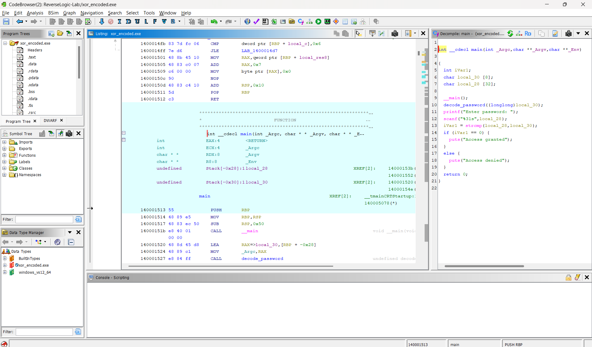
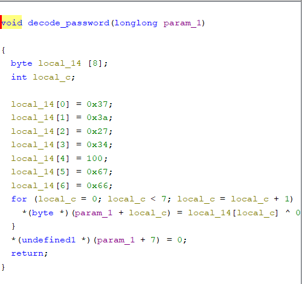
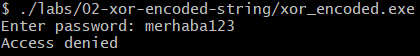
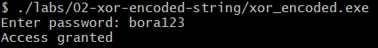
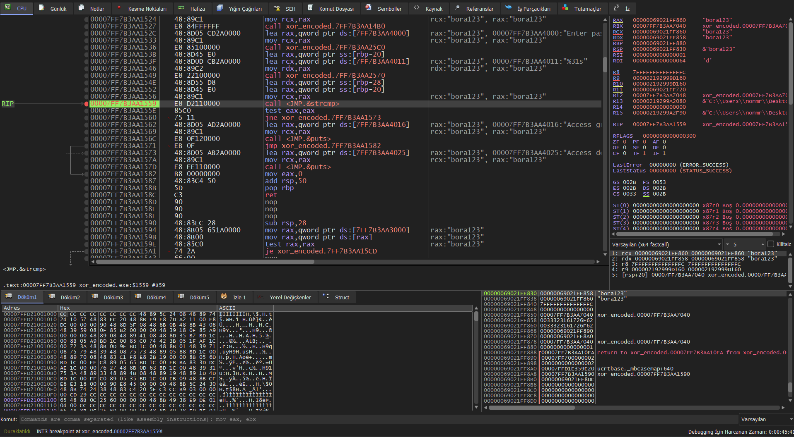

# Lab 02 - XOR Encoded String

## Goal

This lab demonstrates how a hardcoded password can be hidden inside a compiled binary using a simple XOR encoding technique.

In Lab 01, the password was visible as a plain string inside the binary.

In this lab, the password is not stored directly as `bora123`. Instead, it is stored as encoded bytes and decoded at runtime.

The goal is to understand how encoded data, loops, and XOR operations can be identified during reverse engineering.

---

## Source Code Logic

The program stores the password in an encoded byte array:

```c
unsigned char encoded_password[] = {
    0x37, 0x3a, 0x27, 0x34, 0x64, 0x67, 0x66
};
```

The XOR key is:

```c
unsigned char key = 0x55;
```

The password is decoded with this loop:

```c
for (i = 0; i < 7; i++) {
    output[i] = encoded_password[i] ^ key;
}
```

After decoding, the program compares the user input with the decoded password:

```c
if (strcmp(input, decoded_password) == 0) {
    printf("Access granted\n");
} else {
    printf("Access denied\n");
}
```

---

## What XOR Does

XOR is a reversible operation.

If a value is XORed with a key, it can be recovered by XORing it with the same key again.

The basic idea is:

```text
encoded_byte ^ key = original_character
```

In this lab:

```text
0x37 ^ 0x55 = b
0x3a ^ 0x55 = o
0x27 ^ 0x55 = r
0x34 ^ 0x55 = a
0x64 ^ 0x55 = 1
0x67 ^ 0x55 = 2
0x66 ^ 0x55 = 3
```

The decoded password is:

```text
bora123
```

---

## Binary String Check

When checking the compiled executable with the `strings` command, the password does not appear as a plain string.

Command:

```bash
strings xor_encoded.exe | grep bora
```

Expected result:

```text
No output
```

This means the password is not stored directly as the visible string `bora123`.

However, the access messages are still visible:

```bash
strings xor_encoded.exe | grep Access
```

Expected result:

```text
Access granted
Access denied
```

This shows that some strings are visible, but the password itself is encoded.

---

## Ghidra Main Function Analysis

After opening `xor_encoded.exe` in Ghidra and running auto-analysis, the `main` function shows the general program flow:

```c
decode_password(decoded_password);

printf("Enter Password: ");
scanf("%31s", input);

iVar1 = strcmp(input, decoded_password);

if (iVar1 == 0) {
    puts("Access granted");
}
else {
    puts("Access denied");
}
```

The important difference from Lab 01 is that the password is not compared directly as a visible string.

Instead of this:

```c
strcmp(input, "bora123");
```

the program does this:

```c
strcmp(input, decoded_password);
```

This means the password is prepared before the comparison.

---

## Ghidra decode_password Function Analysis

The `decode_password` function contains the actual decoding logic.

The important logic is:

```c
for (i = 0; i < 7; i++) {
    output[i] = encoded_password[i] ^ 0x55;
}

output[7] = '\0';
```

This tells us that:

```text
The program has 7 encoded bytes.
Each byte is XORed with 0x55.
The decoded result becomes a null-terminated C string.
```

The final `'\0'` byte is important because C strings must end with a null terminator.

---

## x64dbg Dynamic Analysis

The binary was also checked with x64dbg to confirm the runtime behavior of the password comparison.

A breakpoint was placed on the `call strcmp` instruction inside the program code. This is the point where the user input is compared with the runtime-decoded password.

At the breakpoint, the register values showed that both comparison arguments contained `bora123`.

This confirms that the encoded password was decoded in memory before the comparison.

The important observation is that the password is not stored as a plain string in the binary. It becomes visible only during runtime after the `decode_password` function finishes.

## Reverse Engineering Idea

In Lab 01, the password was easy to find because it was stored as a readable string.

In Lab 02, the password is hidden using a simple encoding method.

A reverse engineer must now look for:

- suspicious byte arrays
- loops
- XOR operations
- decoded buffers
- comparisons using `strcmp`

The password can still be recovered, but it requires understanding the decoding logic instead of only searching for strings.

---

## What We Learned

This lab shows that:

- not every password or important string appears directly inside a binary
- XOR is a common basic encoding technique
- encoded byte arrays can be decoded by following the program logic
- loops are important during reverse engineering
- `strcmp` can compare user input with a runtime-decoded string
- Ghidra helps reveal the relationship between encoded data and program behavior

---

## Screenshots

### Ghidra main function

The main function shows the high level program flow. The executable calls `decode_password`, asks the user for input, compares the input with the decoded password using `strcmp`, and prints either `Access granted` or `Access denied`.



### Ghidra decode_password function

The `decode_password` function shows the XOR decoding logic. The encoded bytes are decoded at runtime with the XOR key `0x55`.



### Wrong password test

The executable rejects an incorrect password.



### Correct password test

The executable accepts the decoded password `bora123`.



### x64dbg strcmp runtime breakpoint

The debugger stopped at the `strcmp` call. The register view shows that both comparison arguments contain `bora123`.



## Final Conclusion

The executable asks the user for a password.

The real password is not stored as a visible string.

Instead, it is stored as encoded bytes:

```text
37 3a 27 34 64 67 66
```

Each byte is XORed with:

```text
0x55
```

The decoded password becomes:

```text
bora123
```

The main reverse engineering idea of this lab is:

```text
When a string is not visible in the binary, the decoding logic must be analyzed to recover the original value.
```