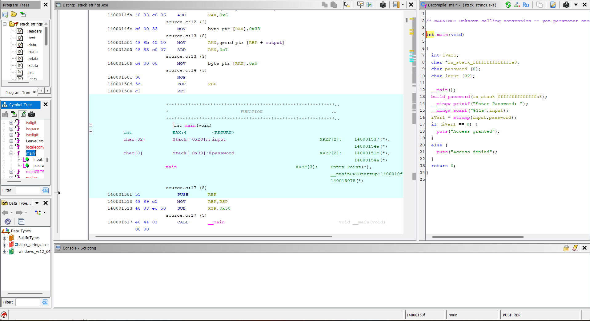
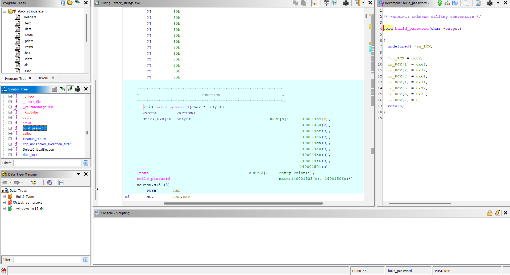
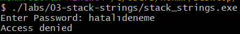
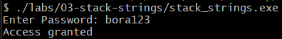

# Lab 03 - Stack Strings

## Goal

This lab demonstrates how a password can be hidden from basic string extraction by building it character by character at runtime.

In Lab 01, the password was stored as a plain string.

In Lab 02, the password was stored as XOR-encoded bytes and decoded at runtime.

In this lab, the password is not stored directly as `bora123` and it is not stored as an encoded byte array. Instead, the program builds the password on the stack one character at a time.

The goal is to understand how stack strings appear during reverse engineering and how they can be identified in Ghidra.

---

## Source Code Logic

The program uses a function named `build_password`.

This function receives an output buffer and writes the password into that buffer one character at a time.

```c
void build_password(char output[])
{
    output[0] = 'b';
    output[1] = 'o';
    output[2] = 'r';
    output[3] = 'a';
    output[4] = '1';
    output[5] = '2';
    output[6] = '3';
    output[7] = '\0';
}
```

The `main` function creates two local buffers:

```c
char input[32];
char password[8];
```

Then it builds the password at runtime:

```c
build_password(password);
```

After that, the program asks the user for input and compares the input with the generated password:

```c
if (strcmp(input, password) == 0)
{
    printf("Access granted\n");
}
else
{
    printf("Access denied\n");
}
```

---

## What Stack Strings Mean

A stack string is a string that is not stored directly as a normal readable string in the binary.

Instead of storing this:

```text
bora123
```

the program creates the string during runtime by writing individual characters into memory.

In this lab, the password is built like this:

```text
output[0] = b
output[1] = o
output[2] = r
output[3] = a
output[4] = 1
output[5] = 2
output[6] = 3
output[7] = null terminator
```

The final result is:

```text
bora123
```

The password becomes a valid C string only after all characters are written and the null terminator is added.

---

## Binary String Check

The compiled executable was checked with the `strings` command.

Command:

```bash
strings stack_strings.exe | grep bora
```

Expected result:

```text
No output
```

This means the password does not appear as a normal plain string inside the binary.

The access messages are still visible:

```bash
strings stack_strings.exe | grep Access
```

Expected result:

```text
Access granted
Access denied
```

This confirms that regular strings can still be visible, but the password itself is hidden from basic string extraction.

---

## Ghidra Main Function Analysis

After opening `stack_strings.exe` in Ghidra and running auto-analysis, the `main` function shows the high level program flow.

The important logic is:

```c
build_password(password);

printf("Enter Password: ");
scanf("%31s", input);

iVar1 = strcmp(input, password);

if (iVar1 == 0) {
    puts("Access granted");
}
else {
    puts("Access denied");
}
```

The important point is that `strcmp` does not compare the user input with a direct string like this:

```c
strcmp(input, "bora123");
```

Instead, it compares the input with a local buffer:

```c
strcmp(input, password);
```

This means the password is created before the comparison.

---

## Ghidra build_password Function Analysis

The `build_password` function reveals how the hidden string is created.

In Ghidra, the characters may appear as hexadecimal values:

```text
0x62
0x6f
0x72
0x61
0x31
0x32
0x33
0x00
```

These values represent:

```text
0x62 = b
0x6f = o
0x72 = r
0x61 = a
0x31 = 1
0x32 = 2
0x33 = 3
0x00 = null terminator
```

So the generated password is:

```text
bora123
```

This shows that the password is not stored as one complete string. It is assembled in memory one byte at a time.

---

## Runtime Test

The executable was tested with both an incorrect password and the correct password.

Incorrect input:

```text
test
```

Result:

```text
Access denied
```

Correct input:

```text
bora123
```

Result:

```text
Access granted
```

This confirms that the stack-built password is used during runtime.

---

## Reverse Engineering Idea

A reverse engineer should not only search for visible strings.

When a password or important value is not visible in the binary, the next step is to inspect how local buffers are filled before comparison functions such as `strcmp`.

In this lab, the key signs are:

- a local character buffer
- repeated writes into that buffer
- hexadecimal character values
- a null terminator
- a later call to `strcmp`

This pattern suggests that the program is building a string at runtime.

---

## Screenshots

### Ghidra main function

The main function shows the high level program flow. The executable calls `build_password`, asks the user for input, compares the input with the generated password using `strcmp`, and prints either `Access granted` or `Access denied`.



### Ghidra build_password function

The `build_password` function shows the stack string logic. The password is created by writing individual character values into the output buffer.



### Wrong password test

The executable rejects an incorrect password.



### Correct password test

The executable accepts the generated password `bora123`.



---

## What We Learned

This lab shows that:

- important strings may not appear directly in the binary
- `strings` output alone is not enough for reverse engineering
- stack strings are built during runtime
- local buffers can hold generated strings
- hexadecimal values can represent ASCII characters
- Ghidra can reveal how a string is assembled before comparison
- `strcmp` is an important clue when analyzing password checks

---

## Final Conclusion

The executable asks the user for a password.

The real password is not stored as a normal visible string.

Instead, the program builds the password in memory using individual character writes.

The generated characters are:

```text
b o r a 1 2 3
```

The final password becomes:

```text
bora123
```

Static analysis with Ghidra showed that the password is built inside the `build_password` function before the `strcmp` comparison.

The main reverse engineering idea of this lab is:

```text
When a string is not visible in the binary, inspect how memory buffers are filled before comparison functions.
```
