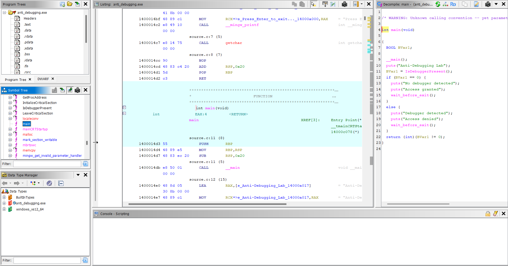
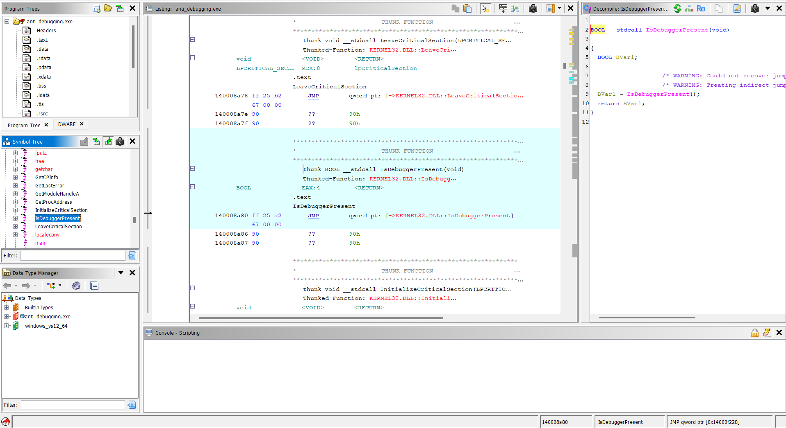
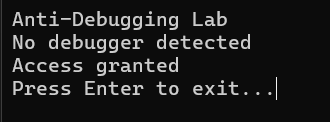

# Lab 04 - Anti-Debugging Check

## Goal

This lab demonstrates a simple anti-debugging technique on Windows.

The program checks whether it is running under a debugger by calling the Windows API function `IsDebuggerPresent`.

If no debugger is detected, the program prints an access granted message.

If a debugger is detected, the program prints an access denied message.

The goal is to understand how basic anti-debugging logic appears in static analysis and how a reverse engineer can identify the debugger check.

---

## Source Code Logic

The program includes the Windows API header:

```c
#include <windows.h>
```

The main anti-debugging check is:

```c
if (IsDebuggerPresent())
{
    printf("Debugger detected\n");
    printf("Access denied\n");
    wait_before_exit();
    return 1;
}
```

If the function returns a non-zero value, the program assumes that a debugger is present.

If the function returns zero, the program continues normally:

```c
printf("No debugger detected\n");
printf("Access granted\n");
wait_before_exit();
```

A small wait function was added so the console output stays visible:

```c
void wait_before_exit()
{
    printf("Press Enter to exit...");
    getchar();
}
```

---

## What IsDebuggerPresent Does

`IsDebuggerPresent` is a Windows API function.

It checks whether the current process is being debugged.

In this lab, the program uses this function as a simple anti-debugging check.

The behavior is:

```text
IsDebuggerPresent() == 0      -> no debugger detected
IsDebuggerPresent() != 0      -> debugger detected
```

This is a basic technique, but it is important because many malware samples use similar checks to detect analysis environments.

---

## Normal Runtime Test

The executable was first tested normally from the terminal.

Output:

```text
Anti-Debugging Lab
No debugger detected
Access granted
Press Enter to exit...
```

This confirms that the program follows the normal branch when no debugger is detected.

---

## Ghidra Main Function Analysis

After opening `anti_debugging.exe` in Ghidra and running auto-analysis, the `main` function clearly shows the anti-debugging logic.

The important part is:

```c
BVar1 = IsDebuggerPresent();

if (BVar1 == 0) {
    puts("No debugger detected");
    puts("Access granted");
    wait_before_exit();
}
else {
    puts("Debugger detected");
    puts("Access denied");
    wait_before_exit();
}
```

This shows that the program behavior depends on the result of `IsDebuggerPresent`.

The reverse engineering idea is to identify the API call and then inspect how the return value controls the program flow.

---

## Ghidra IsDebuggerPresent Import Analysis

Ghidra also shows that `IsDebuggerPresent` is imported from `KERNEL32.DLL`.

The imported function appears as a thunk that jumps to the real Windows API function:

```text
KERNEL32.DLL::IsDebuggerPresent
```

This is useful because imported API functions are strong clues during malware and reverse engineering analysis.

When a binary imports anti-debugging related APIs, a reverse engineer should inspect how those APIs are used.

---

## Reverse Engineering Idea

In previous labs, the main focus was password hiding.

This lab introduces behavior-based analysis.

Instead of only looking for hidden strings, the reverse engineer must inspect API calls and control flow.

Important clues in this lab:

- imported Windows API function
- `IsDebuggerPresent` call
- conditional branch after the API call
- different output depending on the result
- debugger-related behavior change

This pattern is common in basic anti-analysis techniques.

---

## Screenshots

### Ghidra main function

The main function shows the anti-debugging branch. The program calls `IsDebuggerPresent` and changes behavior based on the return value.



### Ghidra IsDebuggerPresent call

Ghidra shows that `IsDebuggerPresent` is imported from `KERNEL32.DLL` and used by the program as a debugger detection API.



### Normal execution

The executable was run normally from the terminal. No debugger was detected and the program printed the access granted path.



---

## What We Learned

This lab shows that:

- Windows API calls can reveal program behavior
- `IsDebuggerPresent` is a basic anti-debugging API
- imported functions are important during static analysis
- control flow after an API call can reveal security logic
- anti-debugging checks can change program behavior during analysis
- Ghidra can identify imported APIs and show how they are used

---

## Final Conclusion

The program uses `IsDebuggerPresent` to check whether it is running under a debugger.

If no debugger is detected, the program prints:

```text
No debugger detected
Access granted
```

If a debugger is detected, the program is designed to print:

```text
Debugger detected
Access denied
```

Static analysis with Ghidra confirmed the anti-debugging logic and showed the imported `KERNEL32.DLL::IsDebuggerPresent` function.

The main reverse engineering idea of this lab is:

```text
When analyzing a binary, imported API functions and the control flow after those calls can reveal anti-analysis behavior.
```
