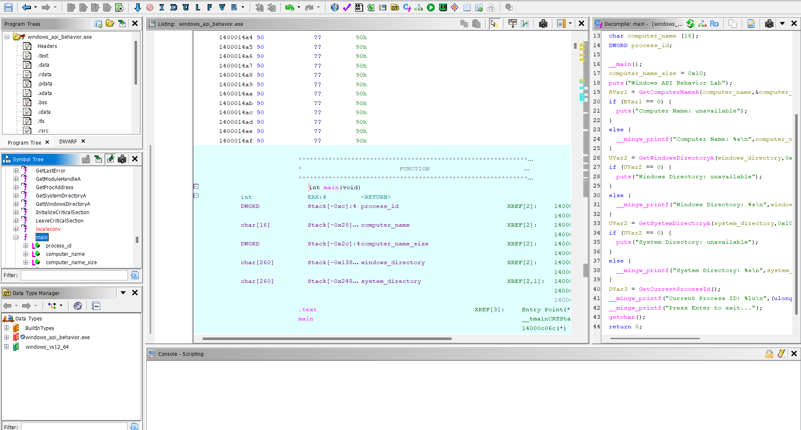

# Lab 05 - Windows API Behavior

## Goal

This lab demonstrates basic Windows API behavior analysis.

The program calls several Windows API functions to collect simple system-related information and prints the results to the console.

The goal is to understand how Windows API usage appears during static analysis and how imported functions can help a reverse engineer understand program behavior.

This lab focuses on behavior, not password checking.

---

## Source Code Logic

The program includes the Windows API header:

```c
#include <windows.h>
```

The program collects and prints the following information:

```text
Computer name
Windows directory
System directory
Current process ID
```

The main Windows API functions used in this lab are:

```text
GetComputerNameA
GetWindowsDirectoryA
GetSystemDirectoryA
GetCurrentProcessId
```

The program first gets the computer name:

```c
GetComputerNameA(computer_name, &computer_name_size);
```

Then it gets the Windows directory:

```c
GetWindowsDirectoryA(windows_directory, MAX_PATH);
```

Then it gets the system directory:

```c
GetSystemDirectoryA(system_directory, MAX_PATH);
```

Finally, it gets the current process ID:

```c
process_id = GetCurrentProcessId();
```

A small wait was added at the end so the console output stays visible:

```c
printf("Press Enter to exit...");
getchar();
```

---

## Windows API Behavior

Windows API functions are often important during reverse engineering and malware analysis.

A program can use Windows API calls to interact with the operating system.

These calls can reveal what the program is trying to do.

In this lab:

```text
GetComputerNameA       -> reads the computer name
GetWindowsDirectoryA   -> finds the Windows installation directory
GetSystemDirectoryA    -> finds the system directory
GetCurrentProcessId    -> gets the current process ID
```

These are simple and safe API calls, but the analysis idea is important.

In real malware analysis, API calls can reveal behavior such as:

```text
file access
registry access
process creation
network communication
injection
anti-debugging
persistence
```

This lab is a basic introduction to reading behavior through API usage.

---

## Runtime Test

The executable was run normally from the terminal.

Example output:

```text
Windows API Behavior Lab
Computer Name: BORAN
Windows Directory: C:\WINDOWS
System Directory: C:\WINDOWS\system32
Current Process ID: 19600
Press Enter to exit...
```

This confirms that the program successfully called the Windows API functions and printed the collected information.

The process ID can change every time the program runs.

---

## Ghidra Main Function Analysis

After opening `windows_api_behavior.exe` in Ghidra and running auto-analysis, the `main` function shows the Windows API calls clearly.

The important calls are:

```c
GetComputerNameA(...);
GetWindowsDirectoryA(...);
GetSystemDirectoryA(...);
GetCurrentProcessId();
```

The decompiled code shows that the program stores API results in local buffers and then prints them with `printf`.

The important reverse engineering observation is that the imported API names explain the behavior of the program before executing it.

For example, seeing `GetComputerNameA` in the binary tells the analyst that the program attempts to read the computer name.

Seeing `GetSystemDirectoryA` tells the analyst that the program interacts with Windows directory information.

---

## Imported API Analysis

Ghidra shows the imported Windows API functions in the symbol list.

The important imported APIs are:

```text
GetComputerNameA
GetWindowsDirectoryA
GetSystemDirectoryA
GetCurrentProcessId
```

Imported API names are strong clues during static analysis.

Even if the source code is not available, imports can help answer this question:

```text
What operating system features does this program use?
```

In this lab, the answer is:

```text
The program queries basic system information from Windows.
```

---

## Reverse Engineering Idea

In previous labs, the focus was mostly on password checks, hidden strings, and anti-debugging.

This lab focuses on API behavior.

A reverse engineer should inspect:

```text
imported functions
API names
function arguments
local buffers
printed output
control flow around API calls
```

This helps build a behavior summary of the executable.

The important idea is:

```text
API calls often explain what a binary does.
```

---

## Screenshots

### Ghidra main function

The main function shows calls to Windows API functions such as `GetComputerNameA`, `GetWindowsDirectoryA`, `GetSystemDirectoryA`, and `GetCurrentProcessId`.



### Ghidra imported APIs

The symbol list shows Windows API functions used by the program. These imports help identify the program behavior during static analysis.


### Runtime output

The executable was run from the terminal and printed system-related information collected through Windows API calls.


---

## What We Learned

This lab shows that:

- Windows API calls are important during reverse engineering
- imported function names can reveal program behavior
- Ghidra can show API calls in the decompiler
- system information can be collected through Windows API functions
- runtime output can confirm static analysis findings
- behavior analysis is not only about strings or passwords
- API usage is a key part of malware analysis

---

## Final Conclusion

The program uses Windows API functions to collect simple system-related information.

The main APIs are:

```text
GetComputerNameA
GetWindowsDirectoryA
GetSystemDirectoryA
GetCurrentProcessId
```

Static analysis with Ghidra showed these API calls clearly in the `main` function.

Runtime testing confirmed that the executable prints the computer name, Windows directory, system directory, and current process ID.

The main reverse engineering idea of this lab is:

```text
Imported API functions are strong clues for understanding program behavior.
```
