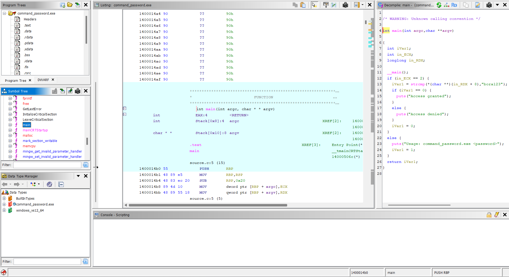
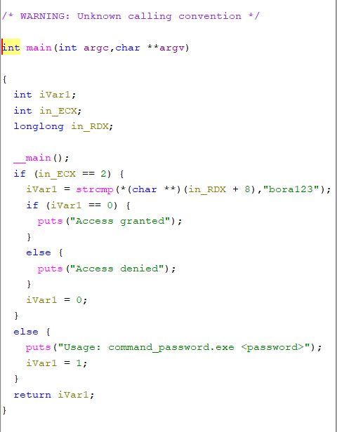
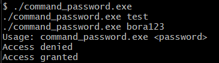

# Lab 06 - Command-Line Password

## Goal

This lab demonstrates how a password check can be implemented through command-line arguments instead of interactive user input.

In previous labs, the program received user input through functions such as `scanf`.

In this lab, the password is passed directly when the program is executed.

Example:

```bash
./command_password.exe bora123
```

The goal is to understand how `argc`, `argv`, and `strcmp` appear in a compiled binary and how this logic can be recovered in Ghidra.

---

## Source Code Logic

The program uses this main function signature:

```c
int main(int argc, char *argv[])
```

The `argc` value stores the number of command-line arguments.

The `argv` array stores the argument values.

For this command:

```bash
./command_password.exe bora123
```

the program receives:

```text
argc = 2
argv[0] = ./command_password.exe
argv[1] = bora123
```

The program first checks whether the user provided exactly one password argument:

```c
if (argc != 2)
{
    printf("Usage: command_password.exe <password>\n");
    return 1;
}
```

If the argument count is correct, the program compares `argv[1]` with the expected password:

```c
if (strcmp(argv[1], "bora123") == 0)
{
    printf("Access granted\n");
}
else
{
    printf("Access denied\n");
}
```

---

## Command-Line Argument Behavior

Command-line arguments are useful because the program does not need to ask for input after it starts.

Instead, the input is already available when the process begins.

The important values are:

```text
argc -> argument count
argv -> argument array
argv[0] -> program path or program name
argv[1] -> first real user-provided argument
```

In this lab, `argv[1]` is used as the password input.

This means the password validation depends on the command-line argument provided by the user.

---

## Runtime Tests

The executable was tested with three different cases.

### Missing argument

Command:

```bash
./command_password.exe
```

Result:

```text
Usage: command_password.exe <password>
```

This shows that the program detects missing command-line arguments.

### Wrong password

Command:

```bash
./command_password.exe test
```

Result:

```text
Access denied
```

This shows that the program rejects an incorrect password argument.

### Correct password

Command:

```bash
./command_password.exe bora123
```

Result:

```text
Access granted
```

This confirms that the program accepts the correct command-line password.

---

## Ghidra Main Function Analysis

After opening `command_password.exe` in Ghidra and running auto-analysis, the `main` function shows the command-line argument logic.

Ghidra identifies the function as:

```c
int main(int argc, char **argv)
```

The argument count check appears as:

```c
if (argc == 2)
```

This means the program expects exactly two arguments:

```text
program name
password argument
```

The password comparison appears as a `strcmp` call.

In the decompiler output, Ghidra may show `argv[1]` in a lower-level form:

```c
*(char **)(argv + 8)
```

or in this lab:

```c
*(char **)(in_RDX + 8)
```

This represents `argv[1]` on a 64-bit system.

The reason is that a pointer is 8 bytes on 64-bit Windows. Adding 8 bytes to the `argv` pointer moves from `argv[0]` to `argv[1]`.

So this decompiled expression:

```c
*(char **)(in_RDX + 8)
```

means:

```c
argv[1]
```

The recovered logic is:

```c
if (argc == 2) {
    strcmp(argv[1], "bora123");
}
else {
    puts("Usage: command_password.exe <password>");
}
```

---

## Reverse Engineering Idea

This lab shows that user input does not always come from `scanf` or console prompts.

A program can also receive input from command-line arguments.

A reverse engineer should look for:

- `argc` checks
- `argv` access
- pointer arithmetic around `argv`
- `strcmp` calls
- usage messages
- success and failure branches

The usage string is also a strong clue:

```text
Usage: command_password.exe <password>
```

This tells the analyst that the program expects a command-line argument.

---

## Screenshots

### Ghidra main function

The main function shows the `argc` check, command-line argument handling, `strcmp` call, and access result branches.



### Ghidra argv strcmp logic

The decompiler output shows that the program compares the first user-provided command-line argument with the expected password.



### Runtime tests

The executable was tested with missing argument, wrong password, and correct password cases.



---

## What We Learned

This lab shows that:

- programs can receive input through command-line arguments
- `argc` controls how many arguments were passed
- `argv[1]` usually contains the first real user argument
- Ghidra may show `argv[1]` as pointer arithmetic
- `strcmp` can compare a command-line argument with a hardcoded password
- usage messages can reveal expected program input
- command-line behavior is important during reverse engineering

---

## Final Conclusion

The program validates a password passed through the command line.

If no password is provided, the program prints:

```text
Usage: command_password.exe <password>
```

If the wrong password is provided, the program prints:

```text
Access denied
```

If the correct password is provided, the program prints:

```text
Access granted
```

Static analysis with Ghidra showed the `argc` check, `argv[1]` usage, and `strcmp` comparison.

The main reverse engineering idea of this lab is:

```text
Command-line arguments can be recovered by analyzing argc, argv, pointer arithmetic, and comparison functions.
```
