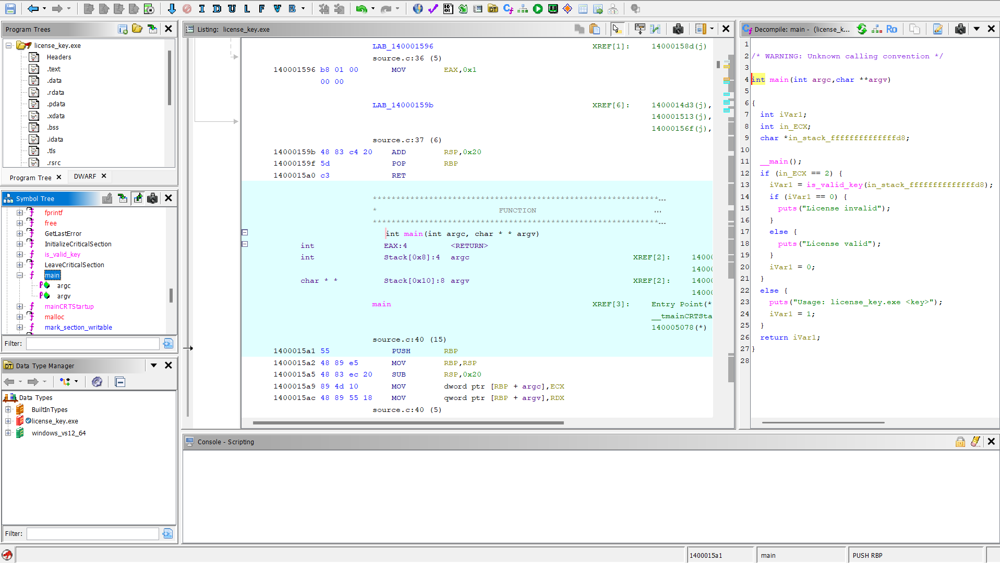
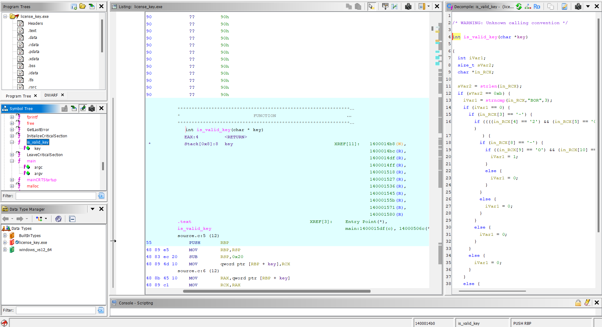
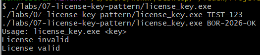

# Lab 07 - License Key Pattern

## Goal

This lab demonstrates how a simple license key pattern can be validated inside a compiled Windows executable.

The goal is to understand how length checks, prefix checks, separator checks, character comparisons, command-line arguments, and validation branches appear in Ghidra.

The expected license key format is:

```text
BOR-2026-OK
```

---

## Source Code Logic

The program receives the license key from the command line.

Example:

```bash
./license_key.exe BOR-2026-OK
```

The program first checks whether exactly one key argument was provided:

```c
if (argc != 2)
{
    printf("Usage: license_key.exe <key>\n");
    return 1;
}
```

Then it sends the provided key to the validation function:

```c
if (is_valid_key(argv[1]))
{
    printf("License valid\n");
}
else
{
    printf("License invalid\n");
}
```

---

## License Key Format

The valid key is:

```text
BOR-2026-OK
```

The program checks the key in pieces:

```text
BOR  -> required prefix
-    -> separator
2026 -> required year value
-    -> separator
OK   -> required suffix
```

The full key length must be 11 characters.

---

## Validation Function

The actual validation logic is inside:

```c
is_valid_key(char key[])
```

First, the program checks the key length:

```c
if (strlen(key) != 11)
{
    return 0;
}
```

Then it checks whether the key starts with `BOR`:

```c
if (strncmp(key, "BOR", 3) != 0)
{
    return 0;
}
```

After that, the remaining characters are checked one by one:

```c
key[3]  == '-'
key[4]  == '2'
key[5]  == '0'
key[6]  == '2'
key[7]  == '6'
key[8]  == '-'
key[9]  == 'O'
key[10] == 'K'
```

If all checks pass, the function returns `1`.

If any check fails, the function returns `0`.

---

## Runtime Tests

The executable was tested with three cases.

### Missing argument

Command:

```bash
./license_key.exe
```

Output:

```text
Usage: license_key.exe <key>
```

### Invalid key

Command:

```bash
./license_key.exe TEST-123
```

Output:

```text
License invalid
```

### Valid key

Command:

```bash
./license_key.exe BOR-2026-OK
```

Output:

```text
License valid
```

This confirms that the program only accepts the expected license key pattern.

---

## Ghidra Main Function Analysis

In Ghidra, the `main` function shows the high-level program flow.

The important logic is:

```c
if (argc == 2) {
    iVar1 = is_valid_key(argv[1]);

    if (iVar1 == 0) {
        puts("License invalid");
    }
    else {
        puts("License valid");
    }
}
else {
    puts("Usage: license_key.exe <key>");
}
```

This shows that:

- the program uses command-line arguments
- `argc` controls whether the user provided a key
- `argv[1]` is passed to `is_valid_key`
- the final output depends on the return value of `is_valid_key`

---

## Ghidra is_valid_key Function Analysis

The `is_valid_key` function contains the actual license validation logic.

Ghidra shows calls to:

```text
strlen
strncmp
```

The `strlen` check confirms that the key length must be 11.

In Ghidra, this may appear as:

```c
sVar2 = strlen(key);
if (sVar2 == 0xb)
```

The value `0xb` is hexadecimal for `11`.

The `strncmp` check confirms that the first three characters must be:

```text
BOR
```

After that, Ghidra shows direct character comparisons for the rest of the key.

This allows the valid key format to be recovered from the binary.

---

## Reverse Engineering Idea

This lab shows that license validation can be performed with multiple smaller checks instead of one simple string comparison.

A reverse engineer can recover the valid key by analyzing:

- command-line argument usage
- `argc` and `argv`
- `strlen`
- `strncmp`
- direct character comparisons
- success and failure branches

The important idea is:

```text
Fixed-format keys can be recovered by following the validation checks one by one.
```

---

## Screenshots

### Ghidra main function

The `main` function shows the command-line argument check, the call to `is_valid_key`, and the valid or invalid output branches.



### Ghidra validation function

The `is_valid_key` function shows the actual validation logic, including length check, prefix check, separator checks, and character comparisons.



### Runtime tests

The runtime test screenshot shows missing argument, invalid key, and valid key cases.



---

## What We Learned

This lab shows that:

- license key validation can be split into many small checks
- `strlen` can reveal the expected input length
- `strncmp` can reveal expected prefixes
- direct character comparisons can reveal the required key format
- command-line arguments can be used as program input
- Ghidra can recover validation logic from compiled binaries

---

## Final Conclusion

The valid license key is:

```text
BOR-2026-OK
```

The program validates this key by checking its length, prefix, separators, year value, and suffix.

Static analysis with Ghidra showed the validation logic clearly.

The main reverse engineering idea of this lab is:

```text
When a binary validates a fixed input format, the correct input can often be reconstructed by following each validation branch.
```
