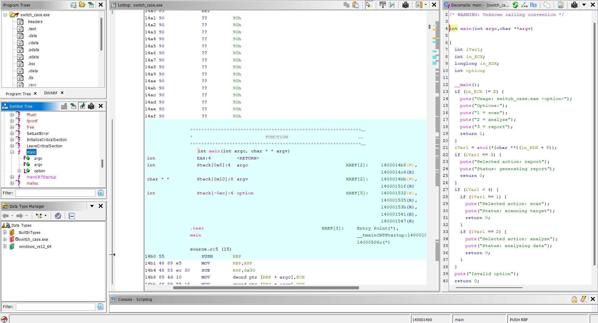
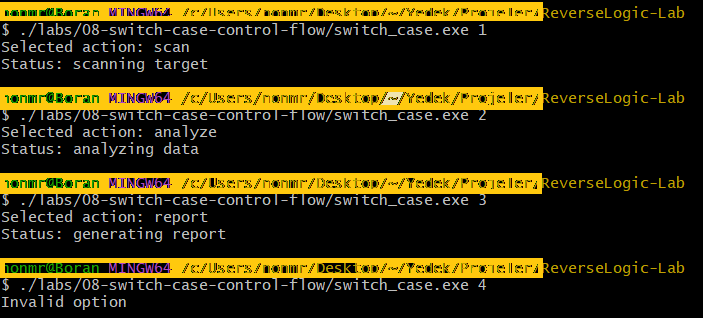

# Lab 08 - Switch Case Control Flow

## Goal

This lab demonstrates how switch-case style control flow appears inside a compiled Windows executable.

The program receives an option from the command line, converts it to an integer, and executes different branches depending on the selected value.

The goal is to understand how menu-based decision logic, command-line arguments, `atoi`, branch conditions, and default behavior appear in Ghidra.

---

## Source Code Logic

The program receives one command-line argument.

Example:

```bash
./switch_case.exe 1
```

The program first checks whether the user provided exactly one option:

```c
if (argc != 2)
{
    printf("Usage: switch_case.exe <option>\n");
    printf("Options:\n");
    printf("1 = scan\n");
    printf("2 = analyze\n");
    printf("3 = report\n");
    return 1;
}
```

Then it converts the command-line argument from string to integer:

```c
option = atoi(argv[1]);
```

After that, it uses a switch-case block:

```c
switch (option)
{
    case 1:
        printf("Selected action: scan\n");
        printf("Status: scanning target\n");
        break;

    case 2:
        printf("Selected action: analyze\n");
        printf("Status: analyzing data\n");
        break;

    case 3:
        printf("Selected action: report\n");
        printf("Status: generating report\n");
        break;

    default:
        printf("Invalid option\n");
        break;
}
```

---

## Program Behavior

The program supports three valid options:

```text
1 -> scan
2 -> analyze
3 -> report
```

Any other value goes to the default branch:

```text
Invalid option
```

This makes the program useful for studying menu-based control flow.

---

## Runtime Tests

The executable was tested with multiple command-line inputs.

### Missing argument

Command:

```bash
./switch_case.exe
```

Expected output:

```text
Usage: switch_case.exe <option>
Options:
1 = scan
2 = analyze
3 = report
```

### Option 1

Command:

```bash
./switch_case.exe 1
```

Expected output:

```text
Selected action: scan
Status: scanning target
```

### Option 2

Command:

```bash
./switch_case.exe 2
```

Expected output:

```text
Selected action: analyze
Status: analyzing data
```

### Option 3

Command:

```bash
./switch_case.exe 3
```

Expected output:

```text
Selected action: report
Status: generating report
```

### Invalid option

Command:

```bash
./switch_case.exe 4
```

Expected output:

```text
Invalid option
```

---

## Ghidra Main Function Analysis

After importing `switch_case.exe` into Ghidra and running auto-analysis, the `main` function shows the command-line argument and control flow logic.

The program first checks the argument count:

```c
if (argc != 2)
```

If the argument count is correct, the program converts the first user-provided argument to an integer:

```c
atoi(argv[1]);
```

In Ghidra, `argv[1]` may appear in a lower-level form like this:

```c
*(char **)(in_RDX + 8)
```

This represents the first real command-line argument on a 64-bit system.

So this expression:

```c
atoi(*(char **)(in_RDX + 8))
```

means:

```c
atoi(argv[1])
```

---

## Switch Case Control Flow in Ghidra

Ghidra did not show the logic as a clean `switch` block in this lab.

Instead, it reconstructed the control flow as a group of `if` conditions.

This is normal.

The source code uses:

```c
switch (option)
```

but the decompiler may recover it like this:

```c
if (option == 3) {
    puts("Selected action: report");
    puts("Status: generating report");
    return 0;
}

if (option < 4) {
    if (option == 1) {
        puts("Selected action: scan");
        puts("Status: scanning target");
        return 0;
    }

    if (option == 2) {
        puts("Selected action: analyze");
        puts("Status: analyzing data");
        return 0;
    }
}

puts("Invalid option");
```

The recovered logic is still correct.

The important point is that Ghidra reveals the same behavior:

```text
option 1 -> scan branch
option 2 -> analyze branch
option 3 -> report branch
other values -> invalid option branch
```

---

## Reverse Engineering Idea

This lab shows that source-level structures may not always appear exactly the same in decompiled output.

A source code `switch` statement may appear as:

```text
switch-case
if-else chain
comparison branches
jump table
```

The exact representation depends on the compiler, optimization level, and binary structure.

A reverse engineer should focus on behavior instead of expecting the decompiler output to match the source code perfectly.

In this lab, the important clues are:

- `argc` check
- `argv[1]` usage
- `atoi` conversion
- comparisons against numeric values
- different output strings for each branch
- default behavior for invalid input

---

## Screenshots

### Ghidra main function

The `main` function shows the argument count check, command-line argument conversion with `atoi`, and the branch logic for different options.


### Ghidra switch control flow

The decompiler output shows the reconstructed control flow. Even though the source uses `switch`, Ghidra represents the logic with comparison branches.



### Runtime tests

The runtime test screenshot shows the behavior for valid and invalid options.



---

## What We Learned

This lab shows that:

- command-line arguments can control program behavior
- `atoi` converts string input into an integer
- switch-case logic can appear as comparison branches in Ghidra
- decompiled output may not exactly match the original source code
- output strings help identify branch purpose
- default branches are important during reverse engineering
- control flow analysis is more important than matching source syntax exactly

---

## Final Conclusion

The program receives an option from the command line and selects a behavior based on that option.

The valid options are:

```text
1 -> scan
2 -> analyze
3 -> report
```

Any other value prints:

```text
Invalid option
```

Static analysis with Ghidra showed the argument handling, `atoi` conversion, and branch-based control flow.

The main reverse engineering idea of this lab is:

```text
A switch-case structure can be recovered by following comparisons, branches, and output strings in the decompiled binary.
```
