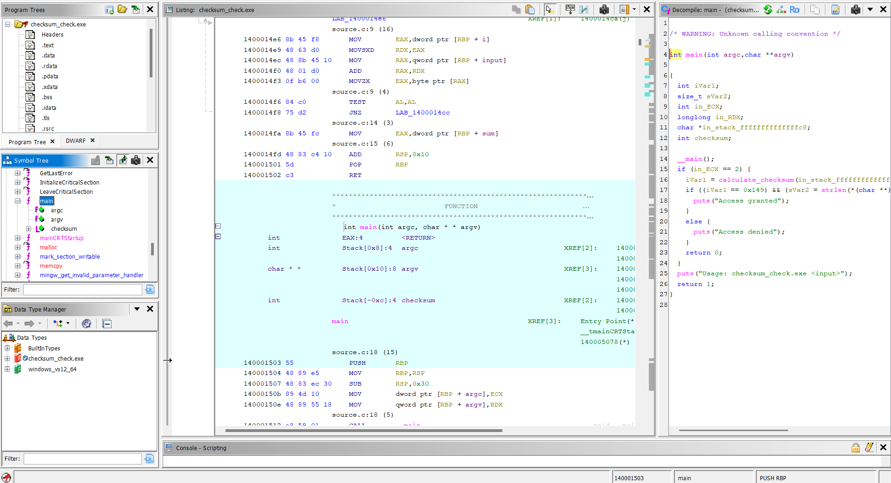
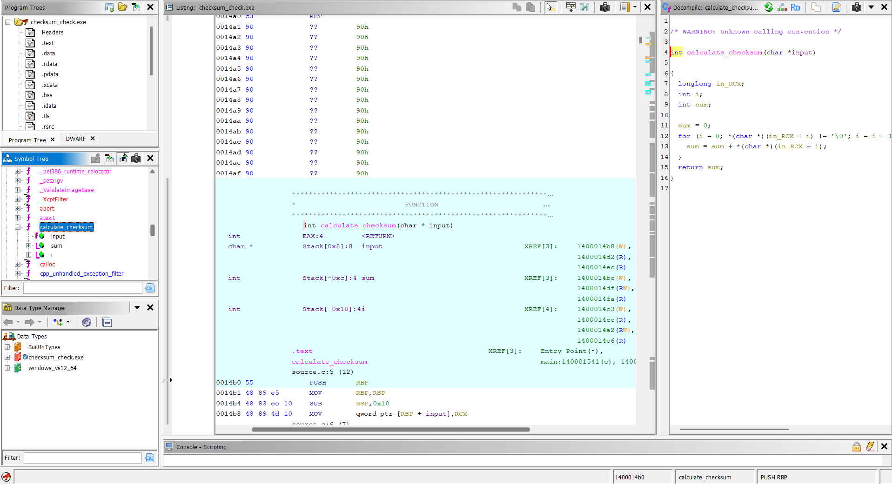
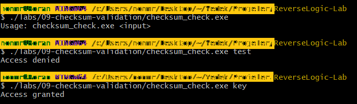

# Lab 09 - Checksum Validation

## Goal

This lab demonstrates how input validation can be performed with a checksum calculation instead of a direct string comparison.

The program receives an input from the command line, calculates the ASCII sum of its characters, and compares the result with an expected checksum value.

The goal is to understand how loops, character access, arithmetic operations, checksum comparisons, and validation branches appear in Ghidra.

---

## Source Code Logic

The program receives one command-line argument.

Example:

```bash
./checksum_check.exe key
```

The program first checks whether exactly one input argument was provided:

```c
if (argc != 2)
{
    printf("Usage: checksum_check.exe <input>\n");
    return 1;
}
```

Then it calculates the checksum of the input:

```c
checksum = calculate_checksum(argv[1]);
```

After that, it checks whether the checksum matches the expected value:

```c
if (checksum == 329 && strlen(argv[1]) == 3)
{
    printf("Access granted\n");
}
else
{
    printf("Access denied\n");
}
```

The expected valid input is:

```text
key
```

---

## Checksum Logic

The checksum is calculated by adding the ASCII value of each character.

The function starts with:

```c
int sum = 0;
```

Then it loops over the input until the null terminator:

```c
for (i = 0; input[i] != '\0'; i++)
{
    sum += input[i];
}
```

Finally, it returns the calculated sum:

```c
return sum;
```

For the valid input:

```text
key
```

the ASCII values are:

```text
k = 107
e = 101
y = 121
```

The total is:

```text
107 + 101 + 121 = 329
```

So the program checks for:

```text
checksum == 329
```

In hexadecimal, this value appears as:

```text
0x149
```

---

## Runtime Tests

The executable was tested with three cases.

### Missing argument

Command:

```bash
./checksum_check.exe
```

Output:

```text
Usage: checksum_check.exe <input>
```

### Wrong input

Command:

```bash
./checksum_check.exe test
```

Output:

```text
Access denied
```

### Correct input

Command:

```bash
./checksum_check.exe key
```

Output:

```text
Access granted
```

This confirms that the program does not directly compare the input string with `key`. Instead, it validates the checksum value and input length.

---

## Ghidra Main Function Analysis

After importing `checksum_check.exe` into Ghidra and running auto-analysis, the `main` function shows the high-level validation flow.

The important logic is:

```c
iVar1 = calculate_checksum(...);

if ((iVar1 == 0x149) && (strlen(...) == 3)) {
    puts("Access granted");
}
else {
    puts("Access denied");
}
```

The value:

```text
0x149
```

is hexadecimal for:

```text
329
```

This means Ghidra recovered the checksum comparison correctly.

The `strlen` check also shows that the input must be exactly 3 characters long.

This matters because different strings can sometimes produce the same checksum. The length check makes the validation slightly more restrictive.

---

## Ghidra calculate_checksum Function Analysis

The `calculate_checksum` function contains the actual loop and addition logic.

Ghidra shows the function with a loop similar to this:

```c
sum = 0;

for (i = 0; input[i] != '\0'; i = i + 1) {
    sum = sum + input[i];
}

return sum;
```

The important reverse engineering details are:

- the function receives a character pointer
- the loop continues until the null terminator
- each character is read from memory
- each character value is added to `sum`
- the final sum is returned to `main`

This shows how a simple checksum algorithm appears in decompiled code.

---

## Reverse Engineering Idea

This lab shows that validation logic does not always use `strcmp`.

A program can validate input using calculations.

A reverse engineer should look for:

- loops over input characters
- character access like `input[i]`
- arithmetic operations
- accumulated variables such as `sum`
- comparison against a constant
- extra checks such as `strlen`

The key observation is:

```text
The valid input can be recovered by understanding the calculation, not by searching for a plain string comparison.
```

---

## Screenshots

### Ghidra main function

The `main` function shows the argument check, checksum calculation, checksum comparison against `0x149`, length check, and access result branches.



### Ghidra checksum function

The `calculate_checksum` function shows the loop that reads each input character and adds its ASCII value to the running sum.



### Runtime tests

The runtime test screenshot shows missing argument, wrong input, and correct input cases.



---

## What We Learned

This lab shows that:

- input validation can be based on calculations
- checksum logic can replace direct string comparison
- loops are important during reverse engineering
- ASCII values can be used in validation logic
- hexadecimal constants in Ghidra should be converted to decimal when needed
- Ghidra can reveal loop-based validation logic
- `strlen` checks can add extra restrictions to checksum validation

---

## Final Conclusion

The program validates input by calculating the ASCII checksum of the provided command-line argument.

The valid input is:

```text
key
```

The checksum is:

```text
107 + 101 + 121 = 329
```

In Ghidra, this value appears as:

```text
0x149
```

Static analysis showed the checksum calculation loop and the comparison against the expected checksum value.

The main reverse engineering idea of this lab is:

```text
When there is no direct string comparison, validation logic can still be recovered by analyzing loops, arithmetic operations, and constants.
```
