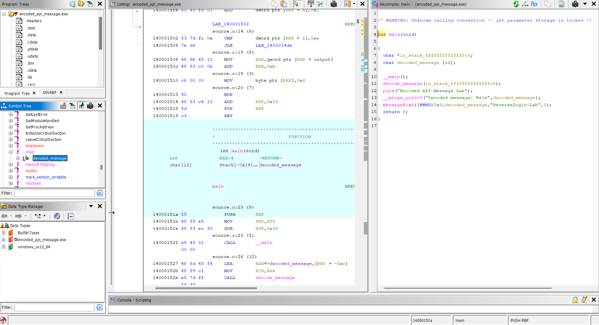

# Lab 10 - Encoded API Message

## Goal

This lab demonstrates how encoded data and Windows API behavior can appear together inside a compiled Windows executable.

The program stores a message as XOR-encoded bytes, decodes it at runtime, prints the decoded message to the terminal, and then displays the same message with the Windows API function `MessageBoxA`.

The goal is to understand how encoded strings, decode loops, local buffers, Windows API imports, and runtime behavior can be identified in Ghidra.

---

## Source Code Logic

The program does not store the message directly as a plain readable string.

Instead, it stores the message as encoded bytes:

```c
unsigned char encoded_message[] = {
    0x14, 0x3b, 0x34, 0x39, 0x2c, 0x26,
    0x3c, 0x26, 0x75, 0x1a, 0x1e
};
```

The XOR key is:

```c
unsigned char key = 0x55;
```

The message is decoded with this loop:

```c
for (i = 0; i < 11; i++)
{
    output[i] = encoded_message[i] ^ key;
}
```

After decoding, the output buffer is terminated as a C string:

```c
output[11] = '\0';
```

The decoded message becomes:

```text
Analysis OK
```

---

## Runtime Behavior

The `main` function creates a local buffer:

```c
char decoded_message[12];
```

Then it calls the decode function:

```c
decode_message(decoded_message);
```

After the message is decoded, the program prints it to the terminal:

```c
printf("Decoded message: %s\n", decoded_message);
```

Then it displays the same decoded message through a Windows API call:

```c
MessageBoxA(NULL, decoded_message, "ReverseLogic-Lab", MB_OK);
```

This means the decoded message is used in two different places:

```text
terminal output
Windows MessageBoxA popup
```

---

## XOR Decoding Logic

XOR is reversible.

If a byte is XORed with a key, the original value can be recovered by XORing it with the same key again.

The basic logic is:

```text
encoded_byte ^ key = decoded_character
```

In this lab:

```text
0x14 ^ 0x55 = A
0x3b ^ 0x55 = n
0x34 ^ 0x55 = a
0x39 ^ 0x55 = l
0x2c ^ 0x55 = y
0x26 ^ 0x55 = s
0x3c ^ 0x55 = i
0x26 ^ 0x55 = s
0x75 ^ 0x55 = space
0x1a ^ 0x55 = O
0x1e ^ 0x55 = K
```

The final decoded message is:

```text
Analysis OK
```

---

## Ghidra Main Function Analysis

After importing `encoded_api_message.exe` into Ghidra and running auto-analysis, the `main` function shows the high-level behavior.

The important logic is:

```c
decode_message(decoded_message);

puts("Encoded API Message Lab");

printf("Decoded message: %s\n", decoded_message);

MessageBoxA((HWND)0x0, decoded_message, "ReverseLogic-Lab", 0);
```

This shows that the program:

```text
1. creates a decoded message buffer
2. decodes the hidden message at runtime
3. prints the decoded message
4. passes the decoded message to MessageBoxA
```

The important reverse engineering observation is that the message is not used directly as a plain string. It is generated before it is printed or passed to the Windows API.

---

## Ghidra decode_message Function Analysis

The `decode_message` function contains the actual decoding logic.

The decompiler shows a loop that writes decoded bytes into the output buffer.

The important operations are:

```text
encoded byte array
XOR key 0x55
loop over 11 bytes
write result into output buffer
null terminate the result
```

The logic can be represented as:

```c
for (i = 0; i < 11; i++) {
    output[i] = encoded_message[i] ^ 0x55;
}

output[11] = '\0';
```

This reveals the hidden message construction process.

A reverse engineer can recover the hidden message by following the decode loop and applying the XOR key to each encoded byte.

---

## Ghidra MessageBoxA Import Analysis

This lab also uses the Windows API function:

```text
MessageBoxA
```

`MessageBoxA` is imported from the Windows user interface library and is used to display a message box.

In this program, the decoded message is passed as the message text:

```c
MessageBoxA(NULL, decoded_message, "ReverseLogic-Lab", MB_OK);
```

This is important because imported API functions are strong clues during malware and reverse engineering analysis.

Even when data is encoded, API usage can reveal how the decoded data is used during runtime.

In this lab, the Windows API call shows that the decoded message is not only printed to the console but also displayed through a graphical popup.

---

## Runtime Test

The executable was run from the terminal.

The terminal output was:

```text
Encoded API Message Lab
Decoded message: Analysis OK
```

The program also displayed a Windows message box with:

```text
Analysis OK
```

This confirms that the hidden message was decoded successfully and passed to `MessageBoxA`.

---

## Reverse Engineering Idea

This lab combines two important analysis ideas:

```text
encoded string recovery
Windows API behavior analysis
```

A reverse engineer should inspect:

- encoded byte arrays
- XOR operations
- decode loops
- local output buffers
- null terminators
- imported Windows API functions
- API arguments
- runtime output

The important idea is:

```text
A binary may hide a string until runtime, then pass the decoded result to an API function.
```

This pattern is useful for understanding how encoded data can be connected to visible program behavior.

---

## Screenshots

### Ghidra main function

The `main` function shows the decoded message buffer, the call to `decode_message`, the terminal output, and the `MessageBoxA` API call.



### Ghidra decode_message function

The `decode_message` function shows the XOR decoding loop that converts encoded bytes into the runtime message.


### Ghidra MessageBoxA import

Ghidra shows the `MessageBoxA` import used by the program to display the decoded message through a Windows API call.


### Runtime output

The runtime output confirms that the encoded message was decoded as `Analysis OK` and displayed by the program.


---

## What We Learned

This lab shows that:

- strings can be stored as encoded bytes
- XOR decoding can reveal hidden runtime messages
- decoded buffers may be passed to API functions
- `MessageBoxA` is a useful Windows API clue during analysis
- Ghidra can show both decode logic and API usage
- runtime behavior confirms static analysis findings
- encoded data and API behavior should be analyzed together

---

## Final Conclusion

The executable stores the message as XOR-encoded bytes.

At runtime, the program decodes the bytes with the key:

```text
0x55
```

The decoded message becomes:

```text
Analysis OK
```

The program then prints the message to the terminal and displays it with:

```text
MessageBoxA
```

Static analysis with Ghidra showed the decode function, the XOR loop, the output buffer, and the Windows API call.

The main reverse engineering idea of this lab is:

```text
Encoded data becomes more meaningful when the analyst connects the decode logic with the API call that uses the decoded result.
```
